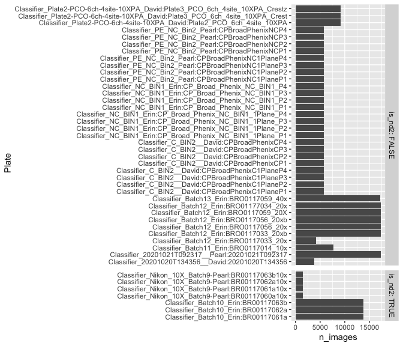
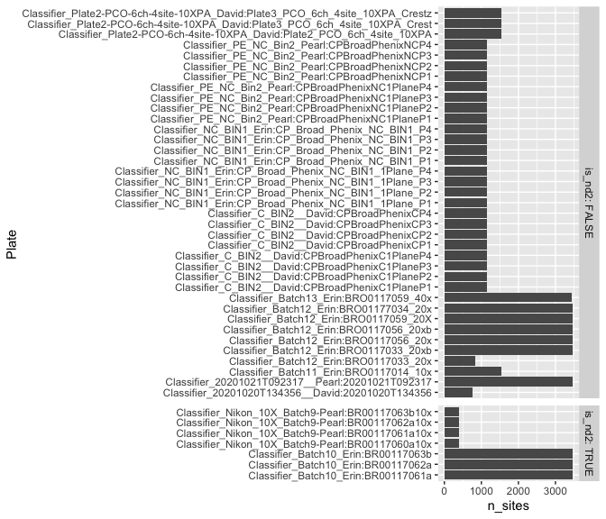
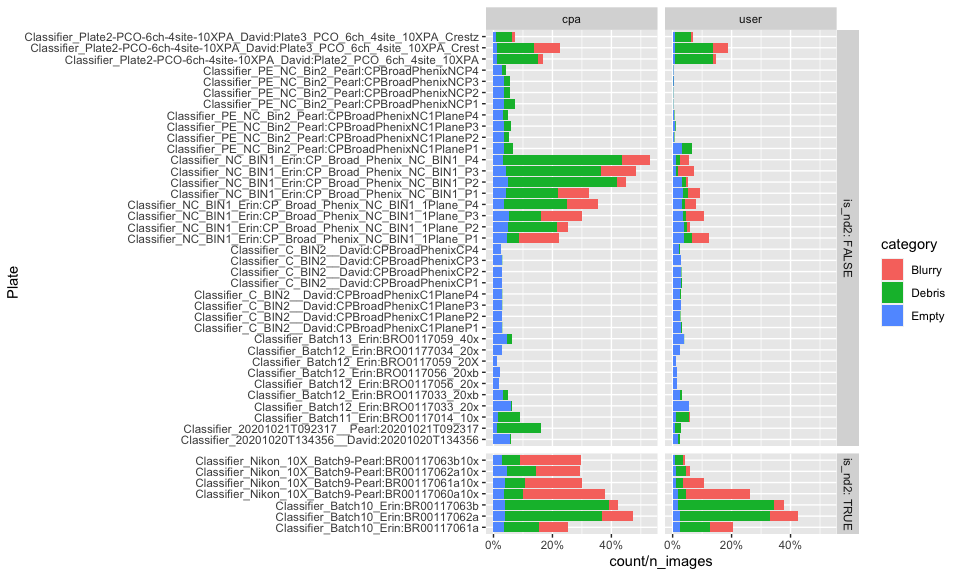
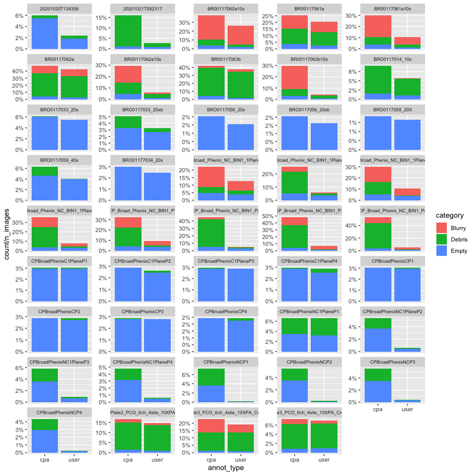
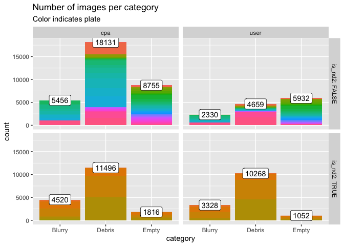
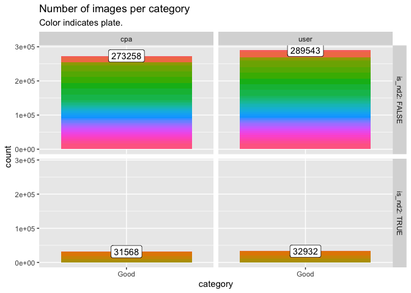
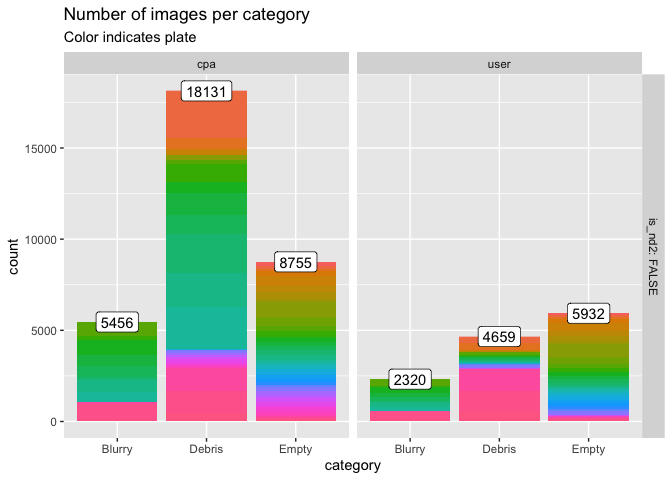
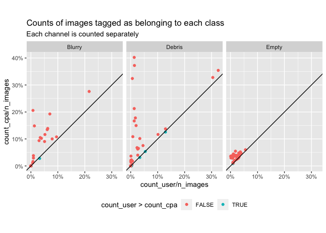
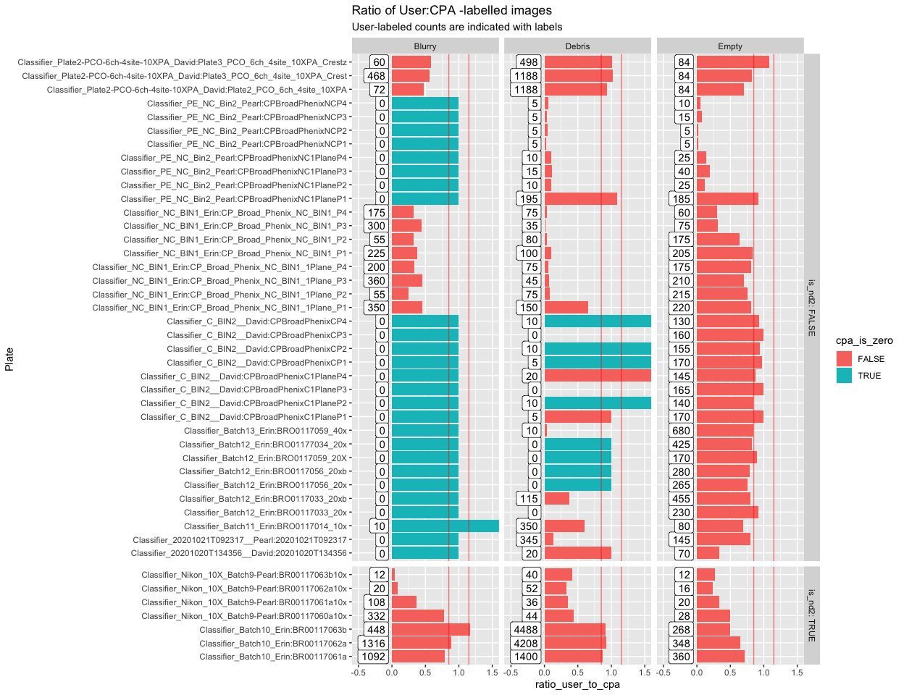
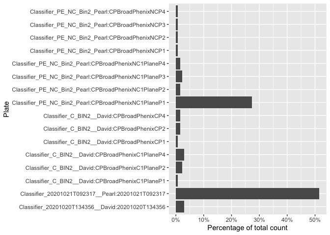

Plot annotation counts
================

``` r
library(glue)
library(tidyverse)
```

``` r
df_counts <-  read_csv("output/qc_annotations_counts.csv")
```

    ## 
    ## ── Column specification ───────────────────────────────────────────────────────────────────────────
    ## cols(
    ##   is_nd2 = col_logical(),
    ##   setname = col_character(),
    ##   filename = col_character(),
    ##   n_channels = col_double(),
    ##   n_sites = col_double(),
    ##   n_images = col_double(),
    ##   image_width = col_double(),
    ##   Image_Metadata_Plate = col_character(),
    ##   Debris = col_double(),
    ##   Empty = col_double(),
    ##   Blurry = col_double(),
    ##   Good = col_double(),
    ##   annot_type = col_character()
    ## )

``` r
df_counts_long <-
  df_counts %>%
  pivot_longer(
    c(Debris, Empty, Blurry, Good),
    names_to = "category",
    values_to = "count"
  )
```

``` r
df_counts_long_report <- 
  df_counts_long %>%
  filter(category != "Good") %>%
  group_by(setname,
           filename,
           is_nd2,
           Image_Metadata_Plate,
           n_sites,
           n_channels,
           n_images,
           image_width,
           annot_type) %>%
  summarize(count = sum(count), .groups = "keep") %>%
  pivot_wider(names_from = "annot_type",
              values_from = "count",
              names_prefix = "count_") %>%
  mutate(
    frac_user = round(count_user / n_images, 2),
    frac_cpa = round(count_cpa / n_images, 2)
  ) %>%
  arrange(setname, is_nd2, Image_Metadata_Plate, n_sites, n_channels)

df_counts_long_report
```

<div class="kable-table">

| setname           | filename                                      | is\_nd2 | Image\_Metadata\_Plate                  | n\_sites | n\_channels | n\_images | image\_width | count\_cpa | count\_user | frac\_user | frac\_cpa |
|:------------------|:----------------------------------------------|:--------|:----------------------------------------|---------:|------------:|----------:|-------------:|-----------:|------------:|-----------:|----------:|
| DavidPearlQCFixed | Classifier\_20201020T134356\_\_David          | FALSE   | 20201020T134356                         |      768 |           5 |      3840 |         2000 |        230 |          90 |       0.02 |      0.06 |
| DavidPearlQCFixed | Classifier\_20201021T092317\_\_Pearl          | FALSE   | 20201021T092317                         |     3454 |           5 |     17270 |         2000 |       2765 |         490 |       0.03 |      0.16 |
| DavidPearlQCFixed | Classifier\_C\_BIN2\_\_David                  | FALSE   | CPBroadPhenixC1PlaneP1                  |     1152 |           5 |      5760 |         1080 |        175 |         175 |       0.03 |      0.03 |
| DavidPearlQCFixed | Classifier\_C\_BIN2\_\_David                  | FALSE   | CPBroadPhenixC1PlaneP2                  |     1152 |           5 |      5760 |         1080 |        165 |         150 |       0.03 |      0.03 |
| DavidPearlQCFixed | Classifier\_C\_BIN2\_\_David                  | FALSE   | CPBroadPhenixC1PlaneP3                  |     1152 |           5 |      5760 |         1080 |        170 |         165 |       0.03 |      0.03 |
| DavidPearlQCFixed | Classifier\_C\_BIN2\_\_David                  | FALSE   | CPBroadPhenixC1PlaneP4                  |     1151 |           5 |      5755 |         1080 |        170 |         165 |       0.03 |      0.03 |
| DavidPearlQCFixed | Classifier\_C\_BIN2\_\_David                  | FALSE   | CPBroadPhenixCP1                        |     1152 |           5 |      5760 |         1080 |        175 |         175 |       0.03 |      0.03 |
| DavidPearlQCFixed | Classifier\_C\_BIN2\_\_David                  | FALSE   | CPBroadPhenixCP2                        |     1152 |           5 |      5760 |         1080 |        165 |         165 |       0.03 |      0.03 |
| DavidPearlQCFixed | Classifier\_C\_BIN2\_\_David                  | FALSE   | CPBroadPhenixCP3                        |     1152 |           5 |      5760 |         1080 |        165 |         160 |       0.03 |      0.03 |
| DavidPearlQCFixed | Classifier\_C\_BIN2\_\_David                  | FALSE   | CPBroadPhenixCP4                        |     1152 |           5 |      5760 |         1080 |        140 |         140 |       0.02 |      0.02 |
| DavidPearlQCFixed | Classifier\_PE\_NC\_Bin2\_Pearl               | FALSE   | CPBroadPhenixNC1PlaneP1                 |     1152 |           5 |      5760 |         1080 |        380 |         380 |       0.07 |      0.07 |
| DavidPearlQCFixed | Classifier\_PE\_NC\_Bin2\_Pearl               | FALSE   | CPBroadPhenixNC1PlaneP2                 |     1152 |           5 |      5760 |         1080 |        310 |          35 |       0.01 |      0.05 |
| DavidPearlQCFixed | Classifier\_PE\_NC\_Bin2\_Pearl               | FALSE   | CPBroadPhenixNC1PlaneP3                 |     1152 |           5 |      5760 |         1080 |        335 |          55 |       0.01 |      0.06 |
| DavidPearlQCFixed | Classifier\_PE\_NC\_Bin2\_Pearl               | FALSE   | CPBroadPhenixNC1PlaneP4                 |     1152 |           5 |      5760 |         1080 |        275 |          35 |       0.01 |      0.05 |
| DavidPearlQCFixed | Classifier\_PE\_NC\_Bin2\_Pearl               | FALSE   | CPBroadPhenixNCP1                       |     1152 |           5 |      5760 |         1080 |        420 |          10 |       0.00 |      0.07 |
| DavidPearlQCFixed | Classifier\_PE\_NC\_Bin2\_Pearl               | FALSE   | CPBroadPhenixNCP2                       |     1152 |           5 |      5760 |         1080 |        315 |          10 |       0.00 |      0.05 |
| DavidPearlQCFixed | Classifier\_PE\_NC\_Bin2\_Pearl               | FALSE   | CPBroadPhenixNCP3                       |     1152 |           5 |      5760 |         1080 |        320 |          20 |       0.00 |      0.06 |
| DavidPearlQCFixed | Classifier\_PE\_NC\_Bin2\_Pearl               | FALSE   | CPBroadPhenixNCP4                       |     1152 |           5 |      5760 |         1080 |        250 |          15 |       0.00 |      0.04 |
| DavidPearlQCFixed | Classifier\_Plate2-PCO-6ch-4site-10XPA\_David | FALSE   | Plate2\_PCO\_6ch\_4site\_10XPA          |     1535 |           6 |      9210 |         5120 |       1536 |        1344 |       0.15 |      0.17 |
| DavidPearlQCFixed | Classifier\_Plate2-PCO-6ch-4site-10XPA\_David | FALSE   | Plate3\_PCO\_6ch\_4site\_10XPA\_Crest   |     1536 |           6 |      9216 |         5120 |       2094 |        1740 |       0.19 |      0.23 |
| DavidPearlQCFixed | Classifier\_Plate2-PCO-6ch-4site-10XPA\_David | FALSE   | Plate3\_PCO\_6ch\_4site\_10XPA\_Crestz  |     1533 |           6 |      9198 |         5120 |        672 |         642 |       0.07 |      0.07 |
| DavidPearlQCFixed | Classifier\_Nikon\_10X\_Batch9-Pearl          | TRUE    | BR00117060a10x                          |      384 |           4 |      1536 |         1608 |        580 |         404 |       0.26 |      0.38 |
| DavidPearlQCFixed | Classifier\_Nikon\_10X\_Batch9-Pearl          | TRUE    | BR00117061a10x                          |      384 |           4 |      1536 |         1608 |        460 |         164 |       0.11 |      0.30 |
| DavidPearlQCFixed | Classifier\_Nikon\_10X\_Batch9-Pearl          | TRUE    | BR00117062a10x                          |      384 |           4 |      1536 |         1608 |        452 |          88 |       0.06 |      0.29 |
| DavidPearlQCFixed | Classifier\_Nikon\_10X\_Batch9-Pearl          | TRUE    | BR00117063b10x                          |      384 |           4 |      1536 |         1608 |        456 |          64 |       0.04 |      0.30 |
| ErinQC            | Classifier\_Batch11\_Erin                     | FALSE   | BRO0117014\_10x                         |     1535 |           5 |      7675 |         2000 |        695 |         440 |       0.06 |      0.09 |
| ErinQC            | Classifier\_Batch12\_Erin                     | FALSE   | BRO0117033\_20x                         |      833 |           5 |      4165 |         2000 |        255 |         230 |       0.06 |      0.06 |
| ErinQC            | Classifier\_Batch12\_Erin                     | FALSE   | BRO0117033\_20xb                        |     3456 |           5 |     17280 |         2000 |        875 |         570 |       0.03 |      0.05 |
| ErinQC            | Classifier\_Batch12\_Erin                     | FALSE   | BRO0117056\_20x                         |     3456 |           5 |     17280 |         2000 |        350 |         265 |       0.02 |      0.02 |
| ErinQC            | Classifier\_Batch12\_Erin                     | FALSE   | BRO0117056\_20xb                        |     3456 |           5 |     17280 |         2000 |        355 |         280 |       0.02 |      0.02 |
| ErinQC            | Classifier\_Batch12\_Erin                     | FALSE   | BRO0117059\_20X                         |     3454 |           5 |     17270 |         1994 |        190 |         170 |       0.01 |      0.01 |
| ErinQC            | Classifier\_Batch13\_Erin                     | FALSE   | BRO0117059\_40x                         |     3451 |           5 |     17255 |         1996 |       1090 |         690 |       0.04 |      0.06 |
| ErinQC            | Classifier\_Batch12\_Erin                     | FALSE   | BRO01177034\_20x                        |     3465 |           5 |     17325 |         2000 |        520 |         425 |       0.02 |      0.03 |
| ErinQC            | Classifier\_NC\_BIN1\_Erin                    | FALSE   | CP\_Broad\_Phenix\_NC\_BIN1\_1Plane\_P1 |     1152 |           5 |      5760 |         2160 |       1275 |         720 |       0.12 |      0.22 |
| ErinQC            | Classifier\_NC\_BIN1\_Erin                    | FALSE   | CP\_Broad\_Phenix\_NC\_BIN1\_1Plane\_P2 |     1152 |           5 |      5760 |         2160 |       1465 |         345 |       0.06 |      0.25 |
| ErinQC            | Classifier\_NC\_BIN1\_Erin                    | FALSE   | CP\_Broad\_Phenix\_NC\_BIN1\_1Plane\_P3 |     1152 |           5 |      5760 |         2160 |       1725 |         615 |       0.11 |      0.30 |
| ErinQC            | Classifier\_NC\_BIN1\_Erin                    | FALSE   | CP\_Broad\_Phenix\_NC\_BIN1\_1Plane\_P4 |     1152 |           5 |      5760 |         2160 |       2045 |         450 |       0.08 |      0.36 |
| ErinQC            | Classifier\_NC\_BIN1\_Erin                    | FALSE   | CP\_Broad\_Phenix\_NC\_BIN1\_P1         |     1152 |           5 |      5760 |         2160 |       1860 |         530 |       0.09 |      0.32 |
| ErinQC            | Classifier\_NC\_BIN1\_Erin                    | FALSE   | CP\_Broad\_Phenix\_NC\_BIN1\_P2         |     1152 |           5 |      5760 |         2160 |       2590 |         310 |       0.05 |      0.45 |
| ErinQC            | Classifier\_NC\_BIN1\_Erin                    | FALSE   | CP\_Broad\_Phenix\_NC\_BIN1\_P3         |     1151 |           5 |      5755 |         2160 |       2775 |         410 |       0.07 |      0.48 |
| ErinQC            | Classifier\_NC\_BIN1\_Erin                    | FALSE   | CP\_Broad\_Phenix\_NC\_BIN1\_P4         |     1151 |           5 |      5755 |         2160 |       3050 |         310 |       0.05 |      0.53 |
| ErinQC            | Classifier\_Batch10\_Erin                     | TRUE    | BR00117061a                             |     3456 |           4 |     13824 |         1608 |       3504 |        2852 |       0.21 |      0.25 |
| ErinQC            | Classifier\_Batch10\_Erin                     | TRUE    | BR00117062a                             |     3456 |           4 |     13824 |         1608 |       6556 |        5872 |       0.42 |      0.47 |
| ErinQC            | Classifier\_Batch10\_Erin                     | TRUE    | BR00117063b                             |     3456 |           4 |     13824 |         1608 |       5824 |        5204 |       0.38 |      0.42 |

</div>

``` r
df_counts_long_report %>%
  write_csv("output/qc_annotations_counts_report.csv")
```

``` r
df_counts_long %>% 
  distinct(Image_Metadata_Plate, filename, n_images, is_nd2) %>%
  ggplot(aes(paste(filename, Image_Metadata_Plate, sep = ":"), n_images)) +
  geom_col() +
  xlab("Plate") +
  facet_grid(
    is_nd2 ~ .,
    labeller = labeller(.rows = label_both),
    scales = "free_y",
    space = "free"
  ) + coord_flip()
```

<!-- -->

``` r
df_counts_long %>% 
  distinct(Image_Metadata_Plate, filename, n_sites, is_nd2) %>%
  ggplot(aes(paste(filename, Image_Metadata_Plate, sep = ":"), n_sites)) +
  geom_col() +
  xlab("Plate") +
  facet_grid(
    is_nd2 ~ .,
    labeller = labeller(.rows = label_both),
    scales = "free_y",
    space = "free"
  ) + coord_flip()
```

<!-- -->

``` r
df_counts_long %>% 
  filter(category != "Good") %>%
  ggplot(aes(paste(filename, Image_Metadata_Plate, sep = ":"), count / n_images, fill = category)) +
  geom_col() +
  xlab("Plate") +
  scale_y_continuous(labels = ~scales::percent(., accuracy = 1)) +
  facet_grid(
    is_nd2 ~ annot_type,
    labeller = labeller(.rows = label_both),
    scales = "free_y",
    space = "free"
  ) + 
  coord_flip()
```

<!-- -->

``` r
df_counts_long %>% 
  filter(category != "Good") %>%
  ggplot(aes(annot_type, count / n_images, fill = category)) +
  geom_col() +
  scale_y_continuous(labels = ~scales::percent(., accuracy = 1)) +
  facet_wrap(~Image_Metadata_Plate, ncol = 5, scales = "free_y") +
  theme(strip.text = element_text(size = 7))
```

<!-- -->

``` r
df_count_total <-
  df_counts %>% 
  group_by(is_nd2, annot_type) %>%
  summarize(across(one_of("Debris", "Empty", "Blurry", "Good"), sum), .groups = "keep") %>%
  pivot_longer(-c(is_nd2, annot_type),  names_to = "category", values_to = "count") 
```

``` r
df_counts_long %>%
  filter(category != "Good") %>%
  ggplot(aes(category, count, fill = Image_Metadata_Plate)) +
  geom_col() +
  geom_label(
    data = df_count_total %>%   filter(category != "Good"),
    aes(category, count,
        label = count),
    fill = "white"
  ) +
  theme(legend.position = "none") +
  ggtitle("Number of images per category", subtitle = "Color indicates plate") +
  facet_grid(is_nd2 ~ annot_type, labeller = labeller(.rows = label_both))
```

<!-- -->

Also plot “Good” class.

We should only consider the CPA version of “Good” to be conservative
because of this:

> The protocol was for the scorers to hand-check all of the CPA non-Good
> predictions, but not the CPA Good predictions

``` r
df_counts_long %>%
  filter(category == "Good") %>%
  ggplot(aes(category, count, fill = Image_Metadata_Plate)) +
  geom_col() +
  geom_label(
    data = df_count_total %>%   filter(category == "Good"),
    aes(category, count,
        label = count),
    fill = "white"
  ) +
  theme(legend.position = "none") +
  ggtitle("Number of images per category", subtitle = "Color indicates plate.") +
  facet_grid(is_nd2 ~ annot_type, labeller = labeller(.rows = label_both))
```

<!-- -->

``` r
arpit_counts <-
  df_counts_long %>%
  filter(filename != "Classifier_Nikon_10X_Batch9-Pearl") %>%
  filter(!(category == "Blurry" & image_width <= 2000)) %>%
  filter(!is_nd2)

arpit_counts_summary <- 
  arpit_counts %>%
  group_by(annot_type, category) %>%
  summarize(count = sum(count), .groups = "keep") %>%
  pivot_wider(names_from = "annot_type", values_from = "count", names_prefix = "count_")

arpit_counts_summary %>%
  write_csv("output/arpit_counts_summary.csv")

arpit_counts %>%
  filter(category != "Good") %>%
  ggplot(aes(category, count, fill = Image_Metadata_Plate)) +
  geom_col() +
  geom_label(
    data =
      arpit_counts %>%
      group_by(annot_type, category) %>%
      summarize(count = sum(count), .groups = "keep") %>%
      filter(category != "Good"),
    aes(category, count,
        label = count),
    fill = "white"
  ) +
  theme(legend.position = "none") +
  ggtitle("Number of images per category", subtitle = "Color indicates plate") +
  facet_grid(is_nd2 ~ annot_type, labeller = labeller(.rows = label_both))
```

<!-- -->

Total counts available are shown below

Recap: we should only consider the CPA version of “Good” to be
conservative because of this:

> The protocol was for the scorers to hand-check all of the CPA non-Good
> predictions, but not the CPA Good predictions

``` r
df_counts_long %>%
  group_by(annot_type, category) %>%
  summarize(count = sum(count), .groups = "keep") %>%
  pivot_wider(names_from = "annot_type", values_from = "count", names_prefix = "count_")
```

<div class="kable-table">

| category | count\_cpa | count\_user |
|:---------|-----------:|------------:|
| Blurry   |       9976 |        5658 |
| Debris   |      29627 |       14927 |
| Empty    |      10571 |        6984 |
| Good     |     304826 |      322475 |

</div>

``` r
df_counts %>%
  pivot_longer(c(Debris, Empty, Blurry, Good),
               names_to = "category",
               values_to = "count") %>%
  pivot_wider(names_from = "annot_type",
              values_from = "count",
              names_prefix = "count_") %>%
  filter(category != "Good") %>%
  ggplot(aes(count_user / n_images, count_cpa / n_images)) +
  geom_point(aes(color = count_user > count_cpa)) +
  facet_wrap( ~ category) +
  geom_abline(slope = 1) +
  coord_equal() +
  scale_x_continuous(labels = ~scales::percent(., accuracy = 1)) +
  scale_y_continuous(labels = ~scales::percent(., accuracy = 1)) +
  ggtitle("Counts of images tagged as belonging to each class",
          subtitle = "Each channel is counted separately") +
  theme(legend.position = "bottom")
```

<!-- -->

``` r
df_counts %>%
  pivot_longer(c(Debris, Empty, Blurry, Good),
               names_to = "category",
               values_to = "count") %>%
  pivot_wider(names_from = "annot_type",
              values_from = "count",
              names_prefix = "count_") %>%
mutate(cpa_is_zero = count_cpa == 0) %>%
mutate(count_cpa = count_cpa + .Machine$double.eps,
         count_user = count_user + .Machine$double.eps,
         ratio_user_to_cpa = count_user / count_cpa,
         ratio_user_to_cpa = ifelse(ratio_user_to_cpa > 2, Inf, ratio_user_to_cpa))  %>%
  filter(category != "Good") %>%
  ggplot(aes(paste(filename, Image_Metadata_Plate, sep = ":"), ratio_user_to_cpa)) +
  geom_col(aes(fill = cpa_is_zero)) +
  geom_label(aes(y = -.05, label = round(count_user, 0)), hjust = "right") +
  xlab("Plate") +
  ylim(c(-.5, 1.5)) +
  facet_grid(
    is_nd2 ~ category,
    labeller = labeller(.rows = label_both),
    scales = "free_y",
    space = "free"
  ) + 
  geom_hline(yintercept = 0.85, color = "red", alpha = 0.5) +
  geom_hline(yintercept = 1.15, color = "red", alpha = 0.5) +
  coord_flip() + 
  ggtitle("Ratio of User:CPA -labelled images", subtitle = "User-labeled counts are indicated with labels")
```

<!-- -->
Debris annotations

``` r
MyTrainingSet_5channel_urls <-
  read_csv(
    "input/debris_annotations/MyTrainingSet_5channel_urls.csv",
    col_types = cols()
  )
```

``` r
MyTrainingSet_5channel_urls %>% count()
```

<div class="kable-table">

|   n |
|----:|
| 208 |

</div>

``` r
MyTrainingSet_5channel_urls %>%
  distinct(Image_Metadata_Plate,
           Image_Metadata_Well,
           Image_Metadata_Site) %>%
  count()
```

<div class="kable-table">

|   n |
|----:|
| 132 |

</div>

``` r
debris_counts <-
  MyTrainingSet_5channel_urls %>%
  distinct(Image_Metadata_Plate,
           Image_Metadata_Well,
           Image_Metadata_Site) %>%
  count(Image_Metadata_Plate, name = "Debris_sites_annotated") %>%
  inner_join(df_counts %>% filter(annot_type == "user"),
             by = c("Image_Metadata_Plate"))


debris_counts %>%
  ggplot(aes(paste(filename, Image_Metadata_Plate, sep = ":"), Debris_sites_annotated)) + 
  geom_col() + 
  xlab("Plate") +
  coord_flip()
```

<!-- -->

``` r
debris_counts %>%
  ggplot(aes(paste(filename, Image_Metadata_Plate, sep = ":"), Debris_sites_annotated/sum(Debris_sites_annotated))) + 
  geom_col() + 
  xlab("Plate") +
  ylab("Percentage of total count") +
  scale_y_continuous(labels = ~scales::percent(., accuracy = 1)) +
  coord_flip()
```

<!-- -->

``` r
debris_counts %>%
  mutate(Debris_sites = Debris / n_channels) %>%
  mutate(diff = Debris_sites_annotated - Debris_sites) %>%
  select(Image_Metadata_Plate, Debris_sites_annotated, Debris_sites, diff)
```

<div class="kable-table">

| Image\_Metadata\_Plate  | Debris\_sites\_annotated | Debris\_sites | diff |
|:------------------------|-------------------------:|--------------:|-----:|
| 20201020T134356         |                        4 |             4 |    0 |
| 20201021T092317         |                       68 |            69 |   -1 |
| CPBroadPhenixC1PlaneP1  |                        1 |             1 |    0 |
| CPBroadPhenixC1PlaneP2  |                        3 |             2 |    1 |
| CPBroadPhenixC1PlaneP4  |                        4 |             4 |    0 |
| CPBroadPhenixCP1        |                        1 |             1 |    0 |
| CPBroadPhenixCP2        |                        2 |             2 |    0 |
| CPBroadPhenixCP4        |                        2 |             2 |    0 |
| CPBroadPhenixNC1PlaneP1 |                       36 |            39 |   -3 |
| CPBroadPhenixNC1PlaneP2 |                        2 |             2 |    0 |
| CPBroadPhenixNC1PlaneP3 |                        3 |             3 |    0 |
| CPBroadPhenixNC1PlaneP4 |                        2 |             2 |    0 |
| CPBroadPhenixNCP1       |                        1 |             1 |    0 |
| CPBroadPhenixNCP2       |                        1 |             1 |    0 |
| CPBroadPhenixNCP3       |                        1 |             1 |    0 |
| CPBroadPhenixNCP4       |                        1 |             1 |    0 |

</div>
