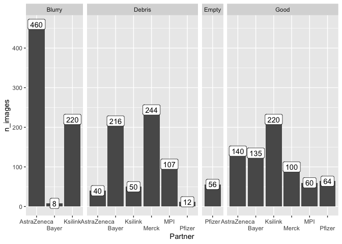
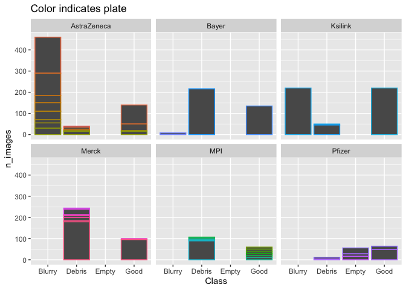
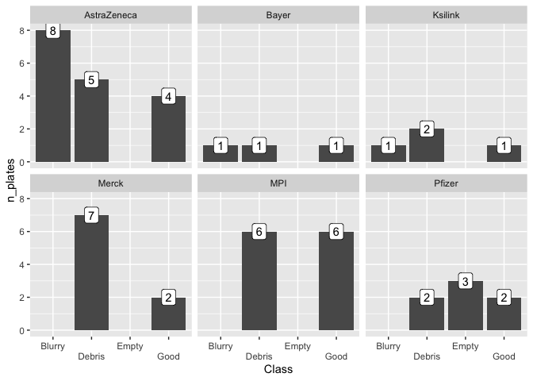
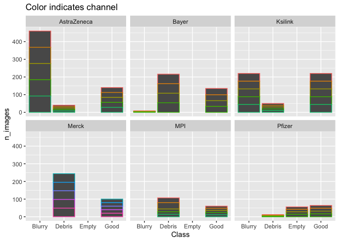
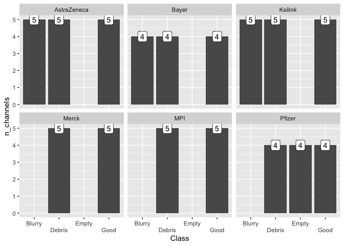

Parse partner images
================

``` r
library(glue)
library(tidyverse)
```

``` r
set.seed(42)
```

``` r
images <- read_csv("input/partner_annotations.csv", col_types = cols(.default = col_character()))
```

``` r
images <-
  images %>%
  mutate(filename = tools::file_path_sans_ext(basename(`Image Path`)))
```

``` r
images %>%
  filter(Partner == "Servier") %>%
  distinct(filename, Class)
```

<div class="kable-table">

| Class  | filename |
|:-------|:---------|
| Good   | j        |
| Good   | b        |
| Good   | c        |
| Good   | i        |
| Good   | g        |
| Good   | a        |
| Good   | e        |
| Good   | d        |
| Good   | h        |
| Good   | f        |
| Blurry | b        |
| Blurry | a        |
| Debris | a        |

</div>

``` r
images <- 
  images %>%
  filter(Partner != "Servier")
```

``` r
images <- 
  images %>%
  filter(!(Partner == "Ksilink" & filename %in% letters))
```

``` r
images %>%
  group_by(Partner) %>%
  slice(1) %>%
  select(filename)
```

    ## Adding missing grouping variables: `Partner`

<div class="kable-table">

| Partner     | filename                                                            |
|:------------|:--------------------------------------------------------------------|
| AstraZeneca | 1031173510\_B10\_T0001F004L01A04Z01C04\_AGP                         |
| Bayer       | AGBU0683\_H01\_S3\_Mito                                             |
| Ksilink     | 20201026-CP-U2OS-SingleDye-20X-bin1x1\_J10\_T0001F002L01A04Z01\_AGP |
| Merck       | GIH00648\_N02\_s2\_w536051DC9-9A08-44AC-A470-69B7090D588F           |
| MPI         | 201124-C2020-5\_C2020\_5\_10uM\_a\_M12\_s5\_DNA                     |
| Pfizer      | CB00170992 \[Well 243, Field 4\]\_AGP\_z01\_t01                     |

</div>

``` r
images_1 <- 
  images %>%
  filter(Partner %in% c("AstraZeneca", "Bayer", "Ksilink", "Merck"))

images_2 <- 
  images %>%
  filter(Partner %in% c("MPI"))

images_3 <- 
  images %>%
  filter(Partner %in% c("Pfizer"))
```

``` r
metadata_cols <- c("Plate", "Well", "Channel")
```

``` r
images_1 %>%
  group_by(Partner) %>%
  sample_n(2) %>%
  select(filename)
```

    ## Adding missing grouping variables: `Partner`

<div class="kable-table">

| Partner     | filename                                                                |
|:------------|:------------------------------------------------------------------------|
| AstraZeneca | 1031173527\_C15\_T0001F004L01A03Z01C03\_RNA                             |
| AstraZeneca | 1031173527\_C21\_T0001F002L01A05Z01C05\_Mito                            |
| Bayer       | AGBU0681\_H15\_S7\_AGP                                                  |
| Bayer       | AGBU0683\_G11\_S7\_Mito                                                 |
| Ksilink     | 20201026-CP-U2OS-SingleDye-20X-bin1x1-Epi\_J08\_T0001F003L01A02Z01\_RNA |
| Ksilink     | 20201026-CP-U2OS-SingleDye-20X-bin1x1\_J12\_T0001F002L01A02Z01\_RNA     |
| Merck       | GIH00648\_C12\_s1\_w22F3BFE1D-5127-49F0-8D2E-3B6AE3247953               |
| Merck       | GIH00648\_C06\_s1\_w5F4AFCD6B-78A3-42E3-B5D5-E46A3F6D5F7F               |

</div>

``` r
regex_1 <- "([a-zA-Z0-9\\- ]+)_([A-Z0-9]+)_[a-zA-Z0-9]+_([a-zA-Z0-9\\-]+)"

images_1 %>%
  group_by(Partner) %>%
  sample_n(2) %>%
  select(filename) %>% 
  extract(filename, metadata_cols, regex_1) %>%
  mutate(Channel = ifelse(str_sub(Channel, 1, 1) != "w", Channel, str_sub(Channel, 1, 2)))
```

    ## Adding missing grouping variables: `Partner`

<div class="kable-table">

| Partner     | Plate                                     | Well | Channel |
|:------------|:------------------------------------------|:-----|:--------|
| AstraZeneca | 1087719106                                | K13  | RNA     |
| AstraZeneca | 1031174111                                | E02  | DNA     |
| Bayer       | AGBU0683                                  | H01  | DNA     |
| Bayer       | AGBU0681                                  | E01  | Mito    |
| Ksilink     | 20201026-CP-U2OS-SingleDye-20X-bin1x1-Epi | J08  | AGP     |
| Ksilink     | 20201026-CP-U2OS-SingleDye-20X-bin1x1     | J11  | RNA     |
| Merck       | GIH00648                                  | E23  | w4      |
| Merck       | GIH00596-p1                               | L02  | w4      |

</div>

``` r
images_2 %>%
  group_by(Partner) %>%
  sample_n(5) %>%
  select(filename)
```

    ## Adding missing grouping variables: `Partner`

<div class="kable-table">

| Partner | filename                                         |
|:--------|:-------------------------------------------------|
| MPI     | 201124-C2020-5\_C2020\_5\_10uM\_a\_C11\_s5\_ER   |
| MPI     | 201124-C2020-5\_C2020\_5\_50uM\_c\_L03\_s4\_DNA  |
| MPI     | 201124-C2020-5\_C2020\_5\_50uM\_c\_H05\_s8\_Mito |
| MPI     | 201124-C2020-5\_C2020\_5\_50uM\_c\_I10\_s5\_ER   |
| MPI     | 201124-C2020-5\_C2020\_5\_50uM\_c\_A05\_s4\_RNA  |

</div>

``` r
regex_2 <- "([A-Z0-9\\-]+_[A-Z0-9a-z_]+)_([A-Z0-9]+)_s[0-9]_([A-Za-z]+)"

images_2 %>%
  group_by(Partner) %>%
  sample_n(10) %>%
  select(filename) %>% 
  extract(filename, metadata_cols, regex_2)
```

    ## Adding missing grouping variables: `Partner`

<div class="kable-table">

| Partner | Plate                                | Well | Channel |
|:--------|:-------------------------------------|:-----|:--------|
| MPI     | 191210\_LDC\_epi\_10\_Q1\_a          | C11  | RNA     |
| MPI     | 201124-C2020-5\_C2020\_5\_30uM\_c    | L03  | ER      |
| MPI     | 191105\_R\_CP\_L\_3uM\_a             | J12  | AGP     |
| MPI     | 201124-C2020-5\_C2020\_5\_50uM\_c    | L23  | DNA     |
| MPI     | 201103-C2020-3-4\_C2020\_10uM\_4\_Q3 | C06  | DNA     |
| MPI     | 191105\_R\_CP\_L\_3uM\_a             | J12  | RNA     |
| MPI     | 201124-C2020-5\_C2020\_5\_50uM\_c    | H05  | Mito    |
| MPI     | 201124-C2020-5\_C2020\_5\_50uM\_c    | I13  | DNA     |
| MPI     | 201103-C2020-3-4\_C2020\_10uM\_4\_Q1 | C12  | ER      |
| MPI     | 200721-CP-20-03\_CP20\_3\_10uM\_a    | D12  | RNA     |

</div>

``` r
images_3 %>%
  group_by(Partner) %>%
  sample_n(5) %>%
  select(filename)
```

    ## Adding missing grouping variables: `Partner`

<div class="kable-table">

| Partner | filename                                         |
|:--------|:-------------------------------------------------|
| Pfizer  | CB00170991 \[Well 286, Field 1\]\_Mito\_z01\_t01 |
| Pfizer  | CB00170992 \[Well 197, Field 3\]\_ER\_z01\_t01   |
| Pfizer  | CB00170991 \[Well 286, Field 3\]\_Mito\_z01\_t01 |
| Pfizer  | CB00170992 \[Well 762, Field 4\]\_DNA\_z01\_t01  |
| Pfizer  | CB00170991 \[Well 286, Field 3\]\_ER\_z01\_t01   |

</div>

``` r
regex_3 <-  "([A-Z0-9]+) \\[Well ([0-9]+), Field [0-9]+\\]_([A-Za-z]+)"

images_3 %>%
  group_by(Partner) %>%
  sample_n(10) %>%
  select(filename) %>% 
  extract(filename, metadata_cols, regex_3)
```

    ## Adding missing grouping variables: `Partner`

<div class="kable-table">

| Partner | Plate      | Well | Channel |
|:--------|:-----------|:-----|:--------|
| Pfizer  | CB00170992 | 197  | DNA     |
| Pfizer  | CB00170991 | 1303 | ER      |
| Pfizer  | CB00170993 | 377  | AGP     |
| Pfizer  | CB00170991 | 1303 | DNA     |
| Pfizer  | CB00170991 | 382  | ER      |
| Pfizer  | CB00170992 | 243  | ER      |
| Pfizer  | CB00170992 | 685  | ER      |
| Pfizer  | CB00170993 | 377  | DNA     |
| Pfizer  | CB00170992 | 243  | ER      |
| Pfizer  | CB00170991 | 1303 | AGP     |

</div>

``` r
images <-
  bind_rows(
    images_1 %>% extract(filename, metadata_cols, regex_1) %>%
      mutate(Channel = ifelse(
        str_sub(Channel, 1, 1) != "w", Channel, str_sub(Channel, 1, 2)
      )),
    images_2 %>% extract(filename, metadata_cols, regex_2),
    images_3 %>% extract(filename, metadata_cols, regex_3)
  )
```

``` r
images %>%
  distinct(Partner, Plate)
```

<div class="kable-table">

| Partner     | Plate                                     |
|:------------|:------------------------------------------|
| AstraZeneca | 1031173510                                |
| AstraZeneca | 1087719083                                |
| AstraZeneca | 1031173527                                |
| AstraZeneca | 1087719106                                |
| AstraZeneca | 1031173343                                |
| AstraZeneca | 1031173534                                |
| AstraZeneca | 1031174104                                |
| AstraZeneca | 1031174067                                |
| AstraZeneca | 1031174111                                |
| Bayer       | AGBU0683                                  |
| Bayer       | AGBU0701                                  |
| Bayer       | AGBU0681                                  |
| Ksilink     | 20201026-CP-U2OS-SingleDye-20X-bin1x1     |
| Ksilink     | 20201026-CP-U2OS-SingleDye-20X-bin1x1-Epi |
| Ksilink     | 20201105-CP-MFM-40X-Bin1x1-ZStack         |
| Merck       | GIH00648                                  |
| Merck       | GIH00593-p2 newGH                         |
| Merck       | GIH00594-p1new                            |
| Merck       | GIH00592-orig                             |
| Merck       | GIH00596-p1                               |
| Merck       | GIH00593-p1                               |
| Merck       | GIH00595-p1                               |
| Merck       | GIH00587                                  |
| MPI         | 201124-C2020-5\_C2020\_5\_10uM\_a         |
| MPI         | 191105\_R\_CP\_L\_3uM\_a                  |
| MPI         | 201103-C2020-3-4\_C2020\_10uM\_4\_Q1      |
| MPI         | 200721-CP-20-03\_CP20\_3\_10uM\_a         |
| MPI         | 191210\_LDC\_epi\_10\_Q1\_a               |
| MPI         | 190924\_R\_190912\_CP\_1\_a               |
| MPI         | 201124-C2020-5\_C2020\_5\_30uM\_c         |
| MPI         | 201124-C2020-5\_C2020\_5\_50uM\_c         |
| MPI         | 201103-C2020-3-4\_C2020\_10uM\_4\_Q2      |
| MPI         | 201124-C2020-5\_C2020\_5\_10uM\_c         |
| MPI         | 200730-C20-3-4\_CP20\_04\_50uM\_a         |
| MPI         | 201103-C2020-3-4\_C2020\_10uM\_4\_Q3      |
| Pfizer      | CB00170992                                |
| Pfizer      | CB00170991                                |
| Pfizer      | CB00170993                                |

</div>

``` r
images %>%
  distinct(Partner, Well)
```

<div class="kable-table">

| Partner     | Well |
|:------------|:-----|
| AstraZeneca | B10  |
| AstraZeneca | K17  |
| AstraZeneca | A01  |
| AstraZeneca | F08  |
| AstraZeneca | D10  |
| AstraZeneca | I04  |
| AstraZeneca | D08  |
| AstraZeneca | K06  |
| AstraZeneca | K05  |
| AstraZeneca | C12  |
| AstraZeneca | B13  |
| AstraZeneca | E23  |
| AstraZeneca | K08  |
| AstraZeneca | C11  |
| AstraZeneca | G15  |
| AstraZeneca | D07  |
| AstraZeneca | B07  |
| AstraZeneca | G12  |
| AstraZeneca | B05  |
| AstraZeneca | C10  |
| AstraZeneca | K23  |
| AstraZeneca | K07  |
| AstraZeneca | L07  |
| AstraZeneca | F18  |
| AstraZeneca | K13  |
| AstraZeneca | D17  |
| AstraZeneca | L13  |
| AstraZeneca | L01  |
| AstraZeneca | D18  |
| AstraZeneca | L04  |
| AstraZeneca | N18  |
| AstraZeneca | B01  |
| AstraZeneca | B02  |
| AstraZeneca | C21  |
| AstraZeneca | C17  |
| AstraZeneca | J15  |
| AstraZeneca | D19  |
| AstraZeneca | D21  |
| AstraZeneca | J19  |
| AstraZeneca | I05  |
| AstraZeneca | D22  |
| AstraZeneca | K16  |
| AstraZeneca | E03  |
| AstraZeneca | B03  |
| AstraZeneca | C15  |
| AstraZeneca | J20  |
| AstraZeneca | C19  |
| AstraZeneca | I15  |
| AstraZeneca | E04  |
| AstraZeneca | O11  |
| AstraZeneca | J08  |
| AstraZeneca | M02  |
| AstraZeneca | C20  |
| AstraZeneca | A02  |
| AstraZeneca | C16  |
| AstraZeneca | C18  |
| AstraZeneca | L11  |
| AstraZeneca | A17  |
| AstraZeneca | E12  |
| AstraZeneca | E09  |
| AstraZeneca | D20  |
| AstraZeneca | I14  |
| AstraZeneca | D23  |
| AstraZeneca | M14  |
| AstraZeneca | I08  |
| AstraZeneca | A19  |
| AstraZeneca | M13  |
| AstraZeneca | J05  |
| AstraZeneca | O20  |
| AstraZeneca | E02  |
| AstraZeneca | J14  |
| AstraZeneca | C14  |
| AstraZeneca | M09  |
| AstraZeneca | I11  |
| AstraZeneca | O10  |
| Bayer       | H01  |
| Bayer       | E19  |
| Bayer       | P23  |
| Bayer       | G11  |
| Bayer       | G15  |
| Bayer       | H15  |
| Bayer       | D13  |
| Bayer       | F24  |
| Bayer       | E01  |
| Bayer       | D04  |
| Bayer       | B16  |
| Ksilink     | J10  |
| Ksilink     | J08  |
| Ksilink     | J11  |
| Ksilink     | J12  |
| Ksilink     | J09  |
| Ksilink     | G13  |
| Merck       | N02  |
| Merck       | H21  |
| Merck       | N20  |
| Merck       | H08  |
| Merck       | B04  |
| Merck       | O10  |
| Merck       | E04  |
| Merck       | O09  |
| Merck       | E02  |
| Merck       | B03  |
| Merck       | O15  |
| Merck       | M23  |
| Merck       | G13  |
| Merck       | C06  |
| Merck       | C21  |
| Merck       | L21  |
| Merck       | I10  |
| Merck       | H07  |
| Merck       | N16  |
| Merck       | E08  |
| Merck       | E01  |
| Merck       | L22  |
| Merck       | C08  |
| Merck       | B18  |
| Merck       | C12  |
| Merck       | H24  |
| Merck       | L13  |
| Merck       | L02  |
| Merck       | E23  |
| Merck       | O12  |
| Merck       | P06  |
| Merck       | I01  |
| Merck       | A12  |
| Merck       | A01  |
| Merck       | P07  |
| Merck       | D02  |
| Merck       | B02  |
| Merck       | C16  |
| Merck       | D05  |
| Merck       | M13  |
| Merck       | L09  |
| Merck       | D22  |
| Merck       | A11  |
| Merck       | N22  |
| Merck       | G08  |
| Merck       | D21  |
| Merck       | E05  |
| Merck       | L03  |
| Merck       | O11  |
| Merck       | L12  |
| Merck       | P11  |
| Merck       | O04  |
| Merck       | O24  |
| Merck       | J03  |
| Merck       | A23  |
| Merck       | C11  |
| Merck       | G09  |
| MPI         | M12  |
| MPI         | J12  |
| MPI         | C12  |
| MPI         | N12  |
| MPI         | L11  |
| MPI         | E12  |
| MPI         | B12  |
| MPI         | C11  |
| MPI         | D12  |
| MPI         | L12  |
| MPI         | L03  |
| MPI         | B09  |
| MPI         | I13  |
| MPI         | L22  |
| MPI         | O02  |
| MPI         | P24  |
| MPI         | H05  |
| MPI         | M18  |
| MPI         | F02  |
| MPI         | P16  |
| MPI         | L01  |
| MPI         | A06  |
| MPI         | I02  |
| MPI         | F17  |
| MPI         | D13  |
| MPI         | N20  |
| MPI         | A05  |
| MPI         | I10  |
| MPI         | H24  |
| MPI         | F23  |
| MPI         | F21  |
| MPI         | G19  |
| MPI         | P20  |
| MPI         | I07  |
| MPI         | G01  |
| MPI         | A08  |
| MPI         | G12  |
| MPI         | L20  |
| MPI         | C06  |
| MPI         | A18  |
| MPI         | P10  |
| MPI         | G20  |
| MPI         | D21  |
| MPI         | H11  |
| MPI         | C13  |
| MPI         | P22  |
| MPI         | P07  |
| MPI         | A02  |
| MPI         | E08  |
| MPI         | N04  |
| MPI         | M20  |
| MPI         | O03  |
| MPI         | C02  |
| MPI         | P05  |
| MPI         | H10  |
| MPI         | J22  |
| MPI         | L23  |
| MPI         | D20  |
| MPI         | D23  |
| Pfizer      | 243  |
| Pfizer      | 197  |
| Pfizer      | 762  |
| Pfizer      | 286  |
| Pfizer      | 418  |
| Pfizer      | 171  |
| Pfizer      | 1303 |
| Pfizer      | 382  |
| Pfizer      | 91   |
| Pfizer      | 5    |
| Pfizer      | 1363 |
| Pfizer      | 1079 |
| Pfizer      | 685  |
| Pfizer      | 377  |
| Pfizer      | 1092 |
| Pfizer      | 194  |
| Pfizer      | 1383 |

</div>

``` r
images %>%
  distinct(Partner, Channel)
```

<div class="kable-table">

| Partner     | Channel |
|:------------|:--------|
| AstraZeneca | AGP     |
| AstraZeneca | Mito    |
| AstraZeneca | DNA     |
| AstraZeneca | RNA     |
| AstraZeneca | ER      |
| Bayer       | Mito    |
| Bayer       | ER      |
| Bayer       | DNA     |
| Bayer       | AGP     |
| Ksilink     | AGP     |
| Ksilink     | Mito    |
| Ksilink     | ER      |
| Ksilink     | RNA     |
| Ksilink     | DNA     |
| Merck       | w5      |
| Merck       | w2      |
| Merck       | w4      |
| Merck       | w3      |
| Merck       | w1      |
| MPI         | DNA     |
| MPI         | ER      |
| MPI         | RNA     |
| MPI         | Mito    |
| MPI         | AGP     |
| Pfizer      | AGP     |
| Pfizer      | Mito    |
| Pfizer      | ER      |
| Pfizer      | DNA     |

</div>

``` r
images %>%
  group_by(Partner, Class) %>%
  tally(name = "n_images") %>%
  ggplot(aes(Partner, n_images)) +
  geom_col() +
  scale_x_discrete(guide = guide_axis(n.dodge = 2), drop = FALSE) +
  geom_label(aes(label = n_images)) +
  facet_grid( ~ Class, space = "free", scales = "free_x") 
```

<!-- -->

``` r
images %>%
  group_by(Partner, Plate, Class) %>%
  tally(name = "n_images") %>%
  ggplot(aes(Class, n_images, color = Plate)) + geom_col() + facet_wrap(~Partner) +
  theme(legend.position = "none") +
  ggtitle("Color indicates plate")
```

<!-- -->

``` r
images %>%
  distinct(Partner, Plate, Class) %>%
  group_by(Partner, Class) %>%
  tally(name = "n_plates") %>%
  ggplot(aes(Class, n_plates)) + 
  geom_col() + 
  facet_wrap(~Partner) +
  scale_x_discrete(guide = guide_axis(n.dodge = 2), drop = FALSE) +
  geom_label(aes(label = n_plates))
```

<!-- -->

``` r
images %>%
  group_by(Partner, Channel, Class) %>%
  tally(name = "n_images") %>%
  ggplot(aes(Class, n_images, color = Channel)) + geom_col() + facet_wrap(~Partner) +
  theme(legend.position = "none") +
  ggtitle("Color indicates channel")
```

<!-- -->

``` r
images %>%
  distinct(Partner, Channel, Class) %>%
  group_by(Partner, Class) %>%
  tally(name = "n_channels") %>%
  ggplot(aes(Class, n_channels)) + 
  geom_col() + 
  facet_wrap(~Partner) +
  scale_x_discrete(guide = guide_axis(n.dodge = 2), drop = FALSE) +
  geom_label(aes(label = n_channels))
```

<!-- -->

``` r
images %>% 
  distinct(Partner, Plate, Well, Channel, Class) %>% 
  group_by(Partner, Plate, Well, Class) %>% 
  tally(name = "n_channels") %>% 
  ungroup %>% 
  count(Class, n_channels, name = "n_wells") %>% 
  select(Class, n_wells, n_channels)
```

<div class="kable-table">

| Class  | n\_wells | n\_channels |
|:-------|---------:|------------:|
| Blurry |        2 |           4 |
| Blurry |       64 |           5 |
| Debris |       39 |           1 |
| Debris |        6 |           2 |
| Debris |        2 |           3 |
| Debris |       12 |           4 |
| Debris |       52 |           5 |
| Empty  |       10 |           4 |
| Good   |        8 |           4 |
| Good   |       62 |           5 |

</div>

``` r
images %>% 
  filter(Class == "Debris") %>%
  distinct(Partner, Plate, Well, Channel) %>% 
  group_by(Partner, Plate, Well) %>% 
  tally(name = "n_channels") %>% 
  ungroup %>% 
  count(Partner, n_channels, name = "n_wells") %>% 
  select(Partner, n_wells, n_channels)
```

<div class="kable-table">

| Partner     | n\_wells | n\_channels |
|:------------|---------:|------------:|
| AstraZeneca |        8 |           5 |
| Bayer       |        6 |           4 |
| Ksilink     |        2 |           5 |
| Merck       |       40 |           5 |
| MPI         |       39 |           1 |
| MPI         |        6 |           2 |
| MPI         |        2 |           3 |
| MPI         |        3 |           4 |
| MPI         |        2 |           5 |
| Pfizer      |        3 |           4 |

</div>

``` r
images %>% 
  write_csv("input/partner_annotations_with_metadata.csv")
```
