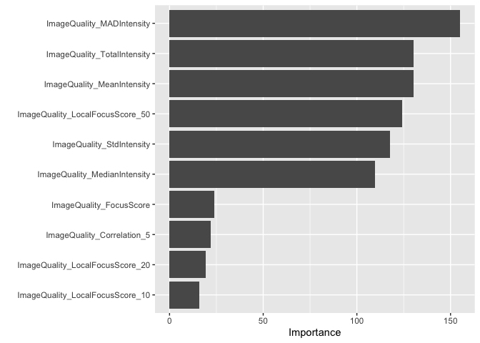

Inspect CellProfiler feature set
================

``` r
library(tidyverse)
library(tidymodels)      # for the recipes package, along with the rest of tidymodels

# Helper packages
library(skimr)           # for variable summaries
```

``` r
df <-
  arrow::read_parquet("output/qc_features_annotations_full.parquet") %>%
  filter(Metadata_Source == "cpa")
```

``` r
class_list <- c("Good", "Blurry", "Empty")
```

``` r
bad_plates <-
  tibble(
    Metadata_Plate =
      c(
        "CP_Broad_Phenix_NC_BIN1_1Plane_P1",
        "CP_Broad_Phenix_NC_BIN1_1Plane_P2",
        "CP_Broad_Phenix_NC_BIN1_1Plane_P3",
        "CP_Broad_Phenix_NC_BIN1_1Plane_P4",
        "CP_Broad_Phenix_NC_BIN1_P1",
        "CP_Broad_Phenix_NC_BIN1_P2",
        "CP_Broad_Phenix_NC_BIN1_P3",
        "CP_Broad_Phenix_NC_BIN1_P4"
      )
  )
```

``` r
df <-
  df %>%
  filter(Class %in% class_list) %>%
  filter(Metadata_Partner == "Broad") %>%
  anti_join(bad_plates) %>%
  select(Class, Metadata_Plate, Metadata_Well, Metadata_Channel, matches("ImageQuality")) %>%
  mutate_if(is.character, as.factor)
```

    ## Joining, by = "Metadata_Plate"

``` r
df <- 
  df %>% 
  group_by(Metadata_Plate, Class) %>%
  tally() %>%
  pivot_wider(names_from = "Class", values_from = "n") %>%
  na.omit() %>% 
  select(Metadata_Plate) %>%
  inner_join(df)
```

    ## Joining, by = "Metadata_Plate"

``` r
df <- 
  recipe(~., df) %>%
  themis::step_downsample(Class, under_ratio = 1) %>%
  prep() %>%
  bake(new_data = NULL)
```

``` r
set.seed(555)
data_split <- initial_split(df, prop = 3/4, strata = "Class")

train_data <- training(data_split)
test_data  <- testing(data_split)
```

``` r
df %>% skim(Class, Metadata_Plate)
```

|                                                  |            |
|:-------------------------------------------------|:-----------|
| Name                                             | Piped data |
| Number of rows                                   | 900        |
| Number of columns                                | 25         |
| \_\_\_\_\_\_\_\_\_\_\_\_\_\_\_\_\_\_\_\_\_\_\_   |            |
| Column type frequency:                           |            |
| factor                                           | 2          |
| \_\_\_\_\_\_\_\_\_\_\_\_\_\_\_\_\_\_\_\_\_\_\_\_ |            |
| Group variables                                  | None       |

Data summary

**Variable type: factor**

| skim\_variable  | n\_missing | complete\_rate | ordered | n\_unique | top\_counts                          |
|:----------------|-----------:|---------------:|:--------|----------:|:-------------------------------------|
| Class           |          0 |              1 | FALSE   |         3 | Blu: 300, Emp: 300, Goo: 300         |
| Metadata\_Plate |          0 |              1 | FALSE   |         3 | Pla: 427, Pla: 263, Pla: 210, 202: 0 |

``` r
train_data %>% skim(Class, Metadata_Plate)
```

|                                                  |            |
|:-------------------------------------------------|:-----------|
| Name                                             | Piped data |
| Number of rows                                   | 675        |
| Number of columns                                | 25         |
| \_\_\_\_\_\_\_\_\_\_\_\_\_\_\_\_\_\_\_\_\_\_\_   |            |
| Column type frequency:                           |            |
| factor                                           | 2          |
| \_\_\_\_\_\_\_\_\_\_\_\_\_\_\_\_\_\_\_\_\_\_\_\_ |            |
| Group variables                                  | None       |

Data summary

**Variable type: factor**

| skim\_variable  | n\_missing | complete\_rate | ordered | n\_unique | top\_counts                          |
|:----------------|-----------:|---------------:|:--------|----------:|:-------------------------------------|
| Class           |          0 |              1 | FALSE   |         3 | Blu: 225, Emp: 225, Goo: 225         |
| Metadata\_Plate |          0 |              1 | FALSE   |         3 | Pla: 312, Pla: 199, Pla: 164, 202: 0 |

``` r
test_data %>% skim(Class, Metadata_Plate)
```

|                                                  |            |
|:-------------------------------------------------|:-----------|
| Name                                             | Piped data |
| Number of rows                                   | 225        |
| Number of columns                                | 25         |
| \_\_\_\_\_\_\_\_\_\_\_\_\_\_\_\_\_\_\_\_\_\_\_   |            |
| Column type frequency:                           |            |
| factor                                           | 2          |
| \_\_\_\_\_\_\_\_\_\_\_\_\_\_\_\_\_\_\_\_\_\_\_\_ |            |
| Group variables                                  | None       |

Data summary

**Variable type: factor**

| skim\_variable  | n\_missing | complete\_rate | ordered | n\_unique | top\_counts                        |
|:----------------|-----------:|---------------:|:--------|----------:|:-----------------------------------|
| Class           |          0 |              1 | FALSE   |         3 | Blu: 75, Emp: 75, Goo: 75          |
| Metadata\_Plate |          0 |              1 | FALSE   |         3 | Pla: 115, Pla: 64, Pla: 46, 202: 0 |

``` r
qc_rec <- 
  recipe(Class ~ ., data = train_data) %>%
  update_role(Metadata_Plate, Metadata_Well, Metadata_Channel, new_role = "ID") %>%
  step_zv(all_predictors())
```

``` r
summary(qc_rec)
```

<div class="kable-table">

| variable                          | type    | role      | source   |
|:----------------------------------|:--------|:----------|:---------|
| Metadata\_Plate                   | nominal | ID        | original |
| Metadata\_Well                    | nominal | ID        | original |
| Metadata\_Channel                 | nominal | ID        | original |
| ImageQuality\_Correlation\_10     | numeric | predictor | original |
| ImageQuality\_Correlation\_20     | numeric | predictor | original |
| ImageQuality\_Correlation\_5      | numeric | predictor | original |
| ImageQuality\_Correlation\_50     | numeric | predictor | original |
| ImageQuality\_FocusScore          | numeric | predictor | original |
| ImageQuality\_LocalFocusScore\_10 | numeric | predictor | original |
| ImageQuality\_LocalFocusScore\_20 | numeric | predictor | original |
| ImageQuality\_LocalFocusScore\_5  | numeric | predictor | original |
| ImageQuality\_LocalFocusScore\_50 | numeric | predictor | original |
| ImageQuality\_MADIntensity        | numeric | predictor | original |
| ImageQuality\_MaxIntensity        | numeric | predictor | original |
| ImageQuality\_MeanIntensity       | numeric | predictor | original |
| ImageQuality\_MedianIntensity     | numeric | predictor | original |
| ImageQuality\_MinIntensity        | numeric | predictor | original |
| ImageQuality\_PercentMaximal      | numeric | predictor | original |
| ImageQuality\_PercentMinimal      | numeric | predictor | original |
| ImageQuality\_PowerLogLogSlope    | numeric | predictor | original |
| ImageQuality\_Scaling             | numeric | predictor | original |
| ImageQuality\_StdIntensity        | numeric | predictor | original |
| ImageQuality\_TotalArea           | numeric | predictor | original |
| ImageQuality\_TotalIntensity      | numeric | predictor | original |
| Class                             | nominal | outcome   | original |

</div>

``` r
tune_spec <- 
  decision_tree(
    cost_complexity = tune(),
    tree_depth = tune()
  ) %>% 
  set_engine("rpart") %>% 
  set_mode("classification")

tune_spec
```

    ## Decision Tree Model Specification (classification)
    ## 
    ## Main Arguments:
    ##   cost_complexity = tune()
    ##   tree_depth = tune()
    ## 
    ## Computational engine: rpart

``` r
tree_grid <- grid_regular(cost_complexity(),
                          tree_depth(),
                          levels = 5)

tree_grid
```

<div class="kable-table">

| cost\_complexity | tree\_depth |
|-----------------:|------------:|
|        0.0000000 |           1 |
|        0.0000000 |           1 |
|        0.0000032 |           1 |
|        0.0005623 |           1 |
|        0.1000000 |           1 |
|        0.0000000 |           4 |
|        0.0000000 |           4 |
|        0.0000032 |           4 |
|        0.0005623 |           4 |
|        0.1000000 |           4 |
|        0.0000000 |           8 |
|        0.0000000 |           8 |
|        0.0000032 |           8 |
|        0.0005623 |           8 |
|        0.1000000 |           8 |
|        0.0000000 |          11 |
|        0.0000000 |          11 |
|        0.0000032 |          11 |
|        0.0005623 |          11 |
|        0.1000000 |          11 |
|        0.0000000 |          15 |
|        0.0000000 |          15 |
|        0.0000032 |          15 |
|        0.0005623 |          15 |
|        0.1000000 |          15 |

</div>

``` r
set.seed(234)
qc_folds <- vfold_cv(train_data)
```

``` r
set.seed(345)

tree_wf <- workflow() %>%
  add_model(tune_spec) %>%
  add_recipe(qc_rec)

tree_res <- 
  tree_wf %>% 
  tune_grid(
    resamples = qc_folds,
    grid = tree_grid
    )

#tree_res
```

``` r
tree_res %>% 
  collect_metrics()
```

<div class="kable-table">

| cost\_complexity | tree\_depth | .metric  | .estimator |      mean |   n |  std\_err | .config                |
|-----------------:|------------:|:---------|:-----------|----------:|----:|----------:|:-----------------------|
|        0.0000000 |           1 | accuracy | multiclass | 0.6372915 |  10 | 0.0188393 | Preprocessor1\_Model01 |
|        0.0000000 |           1 | roc\_auc | hand\_till | 0.7767679 |  10 | 0.0072081 | Preprocessor1\_Model01 |
|        0.0000000 |           1 | accuracy | multiclass | 0.6372915 |  10 | 0.0188393 | Preprocessor1\_Model02 |
|        0.0000000 |           1 | roc\_auc | hand\_till | 0.7767679 |  10 | 0.0072081 | Preprocessor1\_Model02 |
|        0.0000032 |           1 | accuracy | multiclass | 0.6372915 |  10 | 0.0188393 | Preprocessor1\_Model03 |
|        0.0000032 |           1 | roc\_auc | hand\_till | 0.7767679 |  10 | 0.0072081 | Preprocessor1\_Model03 |
|        0.0005623 |           1 | accuracy | multiclass | 0.6372915 |  10 | 0.0188393 | Preprocessor1\_Model04 |
|        0.0005623 |           1 | roc\_auc | hand\_till | 0.7767679 |  10 | 0.0072081 | Preprocessor1\_Model04 |
|        0.1000000 |           1 | accuracy | multiclass | 0.6372915 |  10 | 0.0188393 | Preprocessor1\_Model05 |
|        0.1000000 |           1 | roc\_auc | hand\_till | 0.7767679 |  10 | 0.0072081 | Preprocessor1\_Model05 |
|        0.0000000 |           4 | accuracy | multiclass | 0.6816286 |  10 | 0.0157526 | Preprocessor1\_Model06 |
|        0.0000000 |           4 | roc\_auc | hand\_till | 0.8484633 |  10 | 0.0089717 | Preprocessor1\_Model06 |
|        0.0000000 |           4 | accuracy | multiclass | 0.6816286 |  10 | 0.0157526 | Preprocessor1\_Model07 |
|        0.0000000 |           4 | roc\_auc | hand\_till | 0.8484633 |  10 | 0.0089717 | Preprocessor1\_Model07 |
|        0.0000032 |           4 | accuracy | multiclass | 0.6816286 |  10 | 0.0157526 | Preprocessor1\_Model08 |
|        0.0000032 |           4 | roc\_auc | hand\_till | 0.8484633 |  10 | 0.0089717 | Preprocessor1\_Model08 |
|        0.0005623 |           4 | accuracy | multiclass | 0.6816286 |  10 | 0.0157526 | Preprocessor1\_Model09 |
|        0.0005623 |           4 | roc\_auc | hand\_till | 0.8484633 |  10 | 0.0089717 | Preprocessor1\_Model09 |
|        0.1000000 |           4 | accuracy | multiclass | 0.6372915 |  10 | 0.0188393 | Preprocessor1\_Model10 |
|        0.1000000 |           4 | roc\_auc | hand\_till | 0.7767679 |  10 | 0.0072081 | Preprocessor1\_Model10 |
|        0.0000000 |           8 | accuracy | multiclass | 0.7333406 |  10 | 0.0175017 | Preprocessor1\_Model11 |
|        0.0000000 |           8 | roc\_auc | hand\_till | 0.8646694 |  10 | 0.0109899 | Preprocessor1\_Model11 |
|        0.0000000 |           8 | accuracy | multiclass | 0.7333406 |  10 | 0.0175017 | Preprocessor1\_Model12 |
|        0.0000000 |           8 | roc\_auc | hand\_till | 0.8646694 |  10 | 0.0109899 | Preprocessor1\_Model12 |
|        0.0000032 |           8 | accuracy | multiclass | 0.7333406 |  10 | 0.0175017 | Preprocessor1\_Model13 |
|        0.0000032 |           8 | roc\_auc | hand\_till | 0.8646694 |  10 | 0.0109899 | Preprocessor1\_Model13 |
|        0.0005623 |           8 | accuracy | multiclass | 0.7333406 |  10 | 0.0175017 | Preprocessor1\_Model14 |
|        0.0005623 |           8 | roc\_auc | hand\_till | 0.8646694 |  10 | 0.0109899 | Preprocessor1\_Model14 |
|        0.1000000 |           8 | accuracy | multiclass | 0.6372915 |  10 | 0.0188393 | Preprocessor1\_Model15 |
|        0.1000000 |           8 | roc\_auc | hand\_till | 0.7767679 |  10 | 0.0072081 | Preprocessor1\_Model15 |
|        0.0000000 |          11 | accuracy | multiclass | 0.7422081 |  10 | 0.0175493 | Preprocessor1\_Model16 |
|        0.0000000 |          11 | roc\_auc | hand\_till | 0.8710694 |  10 | 0.0110822 | Preprocessor1\_Model16 |
|        0.0000000 |          11 | accuracy | multiclass | 0.7422081 |  10 | 0.0175493 | Preprocessor1\_Model17 |
|        0.0000000 |          11 | roc\_auc | hand\_till | 0.8710694 |  10 | 0.0110822 | Preprocessor1\_Model17 |
|        0.0000032 |          11 | accuracy | multiclass | 0.7422081 |  10 | 0.0175493 | Preprocessor1\_Model18 |
|        0.0000032 |          11 | roc\_auc | hand\_till | 0.8710694 |  10 | 0.0110822 | Preprocessor1\_Model18 |
|        0.0005623 |          11 | accuracy | multiclass | 0.7422081 |  10 | 0.0175493 | Preprocessor1\_Model19 |
|        0.0005623 |          11 | roc\_auc | hand\_till | 0.8710694 |  10 | 0.0110822 | Preprocessor1\_Model19 |
|        0.1000000 |          11 | accuracy | multiclass | 0.6372915 |  10 | 0.0188393 | Preprocessor1\_Model20 |
|        0.1000000 |          11 | roc\_auc | hand\_till | 0.7767679 |  10 | 0.0072081 | Preprocessor1\_Model20 |
|        0.0000000 |          15 | accuracy | multiclass | 0.7422081 |  10 | 0.0175493 | Preprocessor1\_Model21 |
|        0.0000000 |          15 | roc\_auc | hand\_till | 0.8710694 |  10 | 0.0110822 | Preprocessor1\_Model21 |
|        0.0000000 |          15 | accuracy | multiclass | 0.7422081 |  10 | 0.0175493 | Preprocessor1\_Model22 |
|        0.0000000 |          15 | roc\_auc | hand\_till | 0.8710694 |  10 | 0.0110822 | Preprocessor1\_Model22 |
|        0.0000032 |          15 | accuracy | multiclass | 0.7422081 |  10 | 0.0175493 | Preprocessor1\_Model23 |
|        0.0000032 |          15 | roc\_auc | hand\_till | 0.8710694 |  10 | 0.0110822 | Preprocessor1\_Model23 |
|        0.0005623 |          15 | accuracy | multiclass | 0.7422081 |  10 | 0.0175493 | Preprocessor1\_Model24 |
|        0.0005623 |          15 | roc\_auc | hand\_till | 0.8710694 |  10 | 0.0110822 | Preprocessor1\_Model24 |
|        0.1000000 |          15 | accuracy | multiclass | 0.6372915 |  10 | 0.0188393 | Preprocessor1\_Model25 |
|        0.1000000 |          15 | roc\_auc | hand\_till | 0.7767679 |  10 | 0.0072081 | Preprocessor1\_Model25 |

</div>

``` r
tree_res %>%
  collect_metrics() %>%
  mutate(tree_depth = factor(tree_depth)) %>%
  ggplot(aes(cost_complexity, mean, color = tree_depth)) +
  geom_line(size = 1.5, alpha = 0.6) +
  geom_point(size = 2) +
  facet_wrap(~ .metric, scales = "free", nrow = 2) +
  scale_x_log10(labels = scales::label_number()) +
  scale_color_viridis_d(option = "plasma", begin = .9, end = 0)
```

<!-- -->

``` r
tree_res %>%
  show_best("roc_auc")
```

<div class="kable-table">

| cost\_complexity | tree\_depth | .metric  | .estimator |      mean |   n |  std\_err | .config                |
|-----------------:|------------:|:---------|:-----------|----------:|----:|----------:|:-----------------------|
|        0.0000000 |          11 | roc\_auc | hand\_till | 0.8710694 |  10 | 0.0110822 | Preprocessor1\_Model16 |
|        0.0000000 |          11 | roc\_auc | hand\_till | 0.8710694 |  10 | 0.0110822 | Preprocessor1\_Model17 |
|        0.0000032 |          11 | roc\_auc | hand\_till | 0.8710694 |  10 | 0.0110822 | Preprocessor1\_Model18 |
|        0.0005623 |          11 | roc\_auc | hand\_till | 0.8710694 |  10 | 0.0110822 | Preprocessor1\_Model19 |
|        0.0000000 |          15 | roc\_auc | hand\_till | 0.8710694 |  10 | 0.0110822 | Preprocessor1\_Model21 |

</div>

``` r
best_tree <- tree_res %>%
  select_by_pct_loss(tree_depth, metric = "roc_auc", limit = 5)
```

    ## Warning in 1:best_index: numerical expression has 8 elements: only the first used

``` r
best_tree
```

<div class="kable-table">

| cost\_complexity | tree\_depth | .metric  | .estimator |      mean |   n |  std\_err | .config                |     .best |    .loss |
|-----------------:|------------:|:---------|:-----------|----------:|----:|----------:|:-----------------------|----------:|---------:|
|                0 |           4 | roc\_auc | hand\_till | 0.8484633 |  10 | 0.0089717 | Preprocessor1\_Model06 | 0.8710694 | 2.595212 |

</div>

``` r
final_wf <- 
  tree_wf %>% 
  finalize_workflow(best_tree)

final_wf
```

    ## ══ Workflow ═════════════════════════════════════════════════════════════════════════════════════════════════════════
    ## Preprocessor: Recipe
    ## Model: decision_tree()
    ## 
    ## ── Preprocessor ─────────────────────────────────────────────────────────────────────────────────────────────────────
    ## 1 Recipe Step
    ## 
    ## • step_zv()
    ## 
    ## ── Model ────────────────────────────────────────────────────────────────────────────────────────────────────────────
    ## Decision Tree Model Specification (classification)
    ## 
    ## Main Arguments:
    ##   cost_complexity = 1e-10
    ##   tree_depth = 4
    ## 
    ## Computational engine: rpart

``` r
final_tree <- 
  final_wf %>%
  fit(data = train_data) 

#final_tree
```

``` r
tree_fit <- final_tree %>% extract_fit_parsnip()
rpart.plot::rpart.plot(tree_fit$fit)
```

    ## Warning: Cannot retrieve the data used to build the model (so cannot determine roundint and is.binary for the variables).
    ## To silence this warning:
    ##     Call rpart.plot with roundint=FALSE,
    ##     or rebuild the rpart model with model=TRUE.

<!-- -->

``` r
library(vip)
```

    ## 
    ## Attaching package: 'vip'

    ## The following object is masked from 'package:utils':
    ## 
    ##     vi

``` r
final_tree %>% 
  pull_workflow_fit() %>% 
  vip()
```

    ## Warning: `pull_workflow_fit()` was deprecated in workflows 0.2.3.
    ## Please use `extract_fit_parsnip()` instead.

<!-- -->

``` r
final_fit <- 
  final_wf %>%
  last_fit(data_split) 

final_fit %>%
  collect_metrics()
```

<div class="kable-table">

| .metric  | .estimator | .estimate | .config               |
|:---------|:-----------|----------:|:----------------------|
| accuracy | multiclass | 0.6755556 | Preprocessor1\_Model1 |
| roc\_auc | hand\_till | 0.8785481 | Preprocessor1\_Model1 |

</div>

``` r
final_fit %>%
  collect_predictions() %>% 
  select(-.pred_class) %>%
  roc_curve(Class, matches(".pred")) %>% 
  autoplot()
```

<!-- -->

``` r
confusion_matrix <- 
  final_fit %>%
  collect_predictions() %>%
  conf_mat(Class, .pred_class) 

confusion_matrix
```

    ##           Truth
    ## Prediction Blurry Empty Good
    ##     Blurry     22     0    6
    ##     Empty       0    67    6
    ##     Good       53     8   63

``` r
confusion_matrix %>%
  summary()
```

<div class="kable-table">

| .metric               | .estimator | .estimate |
|:----------------------|:-----------|----------:|
| accuracy              | multiclass | 0.6755556 |
| kap                   | multiclass | 0.5133333 |
| sens                  | macro      | 0.6755556 |
| spec                  | macro      | 0.8377778 |
| ppv                   | macro      | 0.7371957 |
| npv                   | macro      | 0.8531737 |
| mcc                   | multiclass | 0.5524861 |
| j\_index              | macro      | 0.5133333 |
| bal\_accuracy         | macro      | 0.7566667 |
| detection\_prevalence | macro      | 0.3333333 |
| precision             | macro      | 0.7371957 |
| recall                | macro      | 0.6755556 |
| f\_meas               | macro      | 0.6552519 |

</div>
